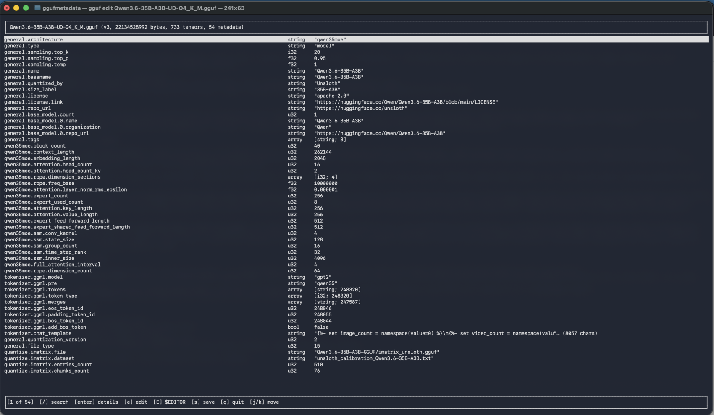

# gguf-surgeon

Surgical metadata edits for GGUF model files: browse the key/value metadata stored in a `.gguf` file and modify fields in place without touching the tensor data.



## Background

GGUF (GGML Universal Format) is the binary container used by `llama.cpp` and related projects to ship LLM weights. Every file starts with a header that describes the model: architecture, name, quantization, context length, tokenizer vocabulary, chat template, and arbitrary user-defined keys. Tensor data follows after the header.

The metadata block is what tools like `llama.cpp`, Ollama, LM Studio, and `transformers` read to decide how to load and run the model. Fixing a wrong field (e.g. a broken chat template, a misnamed architecture, an incorrect EOS token id) currently means re-quantizing the model or running ad-hoc Python scripts — even though the change is just a few bytes in the header.

## Goal

Build an editor that can:

1. **Explore** — open a `.gguf` file and list every metadata key, its type, and its value. Handle all GGUF value types (uint/int 8/16/32/64, float32/64, bool, string, array).
2. **Modify** — let the user change, add, or remove metadata entries and write the result back to a valid `.gguf` file. The tensor payload must remain byte-identical and the file must still load in `llama.cpp`.

## Implementation

The editor is implemented in **Rust**. The language fits the constraints directly:

- **Memory safety on hostile binary input.** Parsing untrusted GGUF files is exactly the kind of work where C/C++ accumulate CVEs and where Rust's bounds checks and ownership model pay off — directly serving the *Robust against malformed input* principle below.
- **Endian-explicit, low-level I/O.** Reading typed primitives in either byte order is straightforward and zero-cost — both little- and big-endian GGUF files are handled. Endianness is auto-detected from the version field at parse time.
- **Streaming and mmap without GC pauses.** `memmap2` for header-region reads, `std::io::BufReader`/`BufWriter` for streaming tensor copies — multi-gigabyte files never enter RAM.
- **Type-tag dispatch with exhaustive matching.** GGUF's value-type enum maps to a Rust `enum`; `match` is checked at compile time, so a new primitive type added later is a hard compiler error rather than a silent fall-through.
- **Cross-platform single binary.** Same codebase for Linux, macOS, and Windows; one static binary per platform makes distribution painless.

The editor exposes both interaction modes from the same binary: a **CLI** with subcommands `list`, `get`, `set`, `add`, `rm`, `patch`, `info`, `check`, `array`, and `edit` for one-shot and scripted use, and a **TUI** built with `ratatui` (`gguf edit`) for interactive browsing and editing — both scalar values and array elements. GGUF files almost always live on remote ML servers reachable only over SSH, so a terminal-native tool fits the audience; a graphical desktop UI is out of scope for the first release.

**Supported GGUF versions: 1, 2, and 3**, in both little- and big-endian. v1 used u32 length prefixes (deprecated in `llama.cpp`); v2 promoted them to u64; v3 added formal big-endian support. Endianness is detected automatically by trying the version field in both byte orders. Files round-trip in their original version and byte order on save. Unknown versions fail loudly at open time.

## Install

Requires a Rust toolchain (`rustup install stable` if you don't have one).

```sh
# Install the binary into ~/.cargo/bin/gguf
cargo install --git https://github.com/nobodywho-ooo/gguf-surgeon

# …or build locally
git clone https://github.com/nobodywho-ooo/gguf-surgeon
cd gguf-surgeon
cargo build --release
# Binary lands at target/release/gguf
```

The compiled binary is named `gguf` (the crate is `gguf-surgeon`).

## Usage

```sh
# Inspect
gguf info MODEL.gguf
gguf list MODEL.gguf
gguf get  MODEL.gguf general.architecture

# Edit one key (set existing, add new, remove)
gguf set MODEL.gguf general.architecture mistral -y
gguf add MODEL.gguf general.author string "vag.gergo" -y
gguf rm  MODEL.gguf outdated.key -y

# Read a long value from a file (chat templates, long Jinja blobs)
gguf get MODEL.gguf tokenizer.chat_template > template.j2
$EDITOR  template.j2
gguf set MODEL.gguf tokenizer.chat_template @template.j2 -y
generate-template.py | gguf set MODEL.gguf tokenizer.chat_template @- -y

# Edit array values element by element
gguf array len    MODEL.gguf tokenizer.ggml.tokens
gguf array push   MODEL.gguf tokenizer.ggml.tokens "<|new_token|>" -y
gguf array set    MODEL.gguf tokenizer.ggml.tokens 5 "<|fixed|>" -y
gguf array insert MODEL.gguf tokenizer.ggml.tokens 0 "<|first|>" -y
gguf array remove MODEL.gguf tokenizer.ggml.tokens 42 -y
gguf array pop    MODEL.gguf tokenizer.ggml.tokens -y

# Batch edits in one save (JSON patch)
gguf patch MODEL.gguf changes.json -y

# Read-only diagnostic: format + built-in suggestions + optional --schema
gguf check MODEL.gguf
gguf --schema my-rules.json check MODEL.gguf
gguf check MODEL.gguf --no-default-schema   # skip the built-in suggestions

# Interactive TUI: j/k move, / search, e edit (arrays open an element editor),
# E open value in $EDITOR (for multi-KB chat templates), s save, q quit
gguf edit MODEL.gguf

# Validate against a schema overlay; --force overrides schema errors
gguf --schema rules.json set MODEL.gguf general.architecture llama

# Control the save path explicitly
gguf --save-mode=rewrite  set MODEL.gguf general.author "me" -y   # always full rewrite
gguf --save-mode=in-place set MODEL.gguf general.author "me" -y   # refuse if it would force tensor copy
```

## Validation and `gguf check`

`gguf check FILE` is a read-only diagnostic that runs three layers of validation in order, merges the results, and prints them. It exits non-zero only if there are errors.

1. **Format-level** — spec invariants from `validate_format`: duplicate keys, and special-token-id values (BOS/EOS/EOT/EOM/UNK/PAD/CLS/MASK/SEP) that are negative or point past the end of `tokenizer.ggml.tokens`. Always on, can never be silenced.
2. **Built-in suggestion schema** — embedded JSON with universal sanity checks (`general.architecture` required, `general.alignment` in 1..=4096, `general.quantization_version` in 1..=10, `general.file_type` is u32). All warnings; never blocks a save. Skip with `--no-default-schema`.
3. **User-supplied `--schema PATH`** — your own JSON rules layered on top. Per-rule severity.

A schema rule looks like:

```json
{
  "version": 1,
  "applies_to": [3],
  "rules": {
    "general.architecture": {
      "type": "string",
      "required": true,
      "enum": ["llama", "mistral", "qwen"],
      "severity": "error"
    },
    "llama.context_length": {
      "type": "u32",
      "min": 256, "max": 1048576,
      "severity": "warning"
    }
  }
}
```

Output tags: `[format-err ]`, `[schema-err ]`, `[schema-warn]`. Same checks run during editing commands' save flow — what `check` shows is what `set`/`add`/`rm`/`patch` would block on (modulo `--force` for schema errors).

## Design principles

The editor must keep working when the GGUF spec changes — without a rewrite. That shapes the design:

- **Generic, not key-aware.** The parser treats metadata as a flat list of `(key, type, value)` triples. It does not know that `general.architecture` or `tokenizer.ggml.tokens` exist or what they mean — and it does not need to. Well-known keys, vendor-specific keys, and arbitrary user-defined keys all flow through the same code path. New well-known keys appear automatically with no code changes.
- **Self-describing input.** Every value carries its type tag in the file. Read the type from the file, never infer it from the key name. Read the format version, alignment, byte order, and tensor-data offset from the header rather than assuming them — endianness is auto-detected from the version field at parse time and preserved on save.
- **Preserve the unknown.** If a future spec adds a new primitive type the editor does not understand, fields of that type are kept as opaque bytes — still listable and round-trip safe, just not editable until support is added.
- **Schema overlay is optional and external.** Any "this key should be a non-empty string", "this key is an enum of these values", or "render this as a chat template" knowledge lives in a swappable JSON schema file, not in the code. Updating for a new spec version means dropping in a new schema file. Each overlay declares the GGUF version range it applies to. The overlay file format itself has a defined schema and is validated on load: a malformed overlay is rejected, never silently ignored.
- **Always verify version compatibility on open.** Every time a file is opened, the version field is read from the header and checked against the set of versions this build supports (currently `1, 2, 3`). Known version → proceed. Unknown version → fail loudly with the version number; never silently assume a newer version behaves like an older one.
- **Validate before writing.** Every save runs constraint checks. Two layers, with different save-time behavior:
  1. *Format-level* (always enforced) — duplicate metadata keys are rejected; special token-id keys (`tokenizer.ggml.bos_token_id`, `eos_token_id`, etc.) must point inside the `tokenizer.ggml.tokens` array if both are present, otherwise generation crashes at runtime in `llama.cpp`. Other invariants (UTF-8 strings, type tags matching the encoded value, uniform array element types, count consistency) are guaranteed by the parser/encoder rather than by an explicit pass — the type system enforces them. Format-level failures **block the save unconditionally** — there is no `--force` override, because the result would not be a valid GGUF file and the failure would just move from save-time to load-time.
  2. *Schema-level* (enforced when a schema overlay is loaded) — type spec match, enum membership, numeric `min`/`max`, string/array `min_length`/`max_length`, and `required: true` for keys that should be present. Each rule is tagged `warning` or `error` in the overlay:
     - *warnings* show up in the preview/diff but do not block the save.
     - *errors* block the save by default, but are overridable with an explicit `--force` flag, since schemas can be wrong or out of date and the user may know something the overlay does not.

     A built-in suggestion schema ships with the editor (universal `general.*` rules, all `warning` severity). It runs automatically on `gguf check` and editing commands. Add your own with `--schema PATH`, or skip the built-in with `--no-default-schema` on `check`.
- **Safe, atomic writes with two save paths.** GGUF files are gigabytes; a partial write loses the model. Every save goes through `write to temporary file → fsync → atomic rename over the original`, even trivial edits, so a crash never leaves the file half-written. The editor picks one of two paths automatically based on whether the new encoded header is the same size as the original `tensor_data_offset`:
  1. *Header overwrite* — the new metadata block fits within the existing header region (typical when the change is absorbed by the reserved padding budget). The temp is created via `std::fs::copy`, which uses `clonefile` on macOS APFS and `copy_file_range` with reflink on Linux Btrfs/XFS — on those filesystems tensor bytes are never physically read or written. On filesystems without copy-on-write (ext4, NTFS), `std::fs::copy` falls back to a regular byte copy. After the copy, only the header region is overwritten in place.
  2. *Full rewrite* — the size delta exceeds the padding budget. Tensor data must shift to a new offset. The whole file is streamed through `BufReader`/`BufWriter` chunks: header re-emitted, tensor-info offsets stay valid (they're relative to the tensor-data start), tensor data copied to the temp, then atomically renamed.

  The editor reserves **64 KB of header padding** on every save (a vendor-namespaced `ggufsurgeon.padding` sentinel key holding zeros, sized to round the header up to the next 64 KB boundary) so that most realistic edits — chat-template changes, vocab tweaks, key additions — stay in the header-overwrite path and never trigger a full tensor copy. The sentinel key is filtered out of user-facing displays (`list`, `get`, TUI). Files written by older versions of this editor used `general.padding`; that is silently migrated on the next save when its content matches the editor's own zero-array shape.
- **Streaming I/O.** Tensor bytes are never fully loaded into memory. Only the header and the tensor-descriptor table are parsed; tensor data flows through in fixed-size chunks during a rewrite. The editor must work on multi-gigabyte files on a machine with modest RAM.
- **Robust against malformed input.** Treat every input file as untrusted. Cap declared array, string, and tensor sizes against the actual file length, bounds-check every offset, reject overflowing or circular values. The parser must fail cleanly — never crash, hang, or allocate unboundedly — on a corrupt or hostile file.

The result: a spec change at most requires updating an external schema file — never a code release. A file from a future, unknown version is never silently corrupted. And a file written by this editor will not violate its own format or any constraint the loaded schema declares.

## Scope

- Read and write GGUF v1, v2, and v3, in both little- and big-endian.
- Preserve tensor data, alignment, and padding exactly.
- Edit scalar values (integers, floats, bools, strings) via CLI (`set`, `add`) or TUI. CLI accepts `@FILE` (read value from file) and `@-` (read from stdin) for ergonomic chat-template editing; TUI binds `E` to open the current value in `$EDITOR` and read the result back. Edit array values (tokenizer vocabulary, merges) element-by-element via `gguf array {set,push,pop,insert,remove,len}`, or as a whole via the `patch` JSON command.
- Treat custom and arbitrary keys as first-class. Any key name in any namespace can be listed, edited, added, or removed. Well-known keys get no special privileges; unknown keys get no special restrictions. The optional schema overlay only affects display and validation hints — its absence never blocks editing.
- Round-trip safety: re-saving an unedited file produces a byte-identical output, even for files containing keys or types the editor has never seen before.
- Preview before save: every save shows a diff (added, removed, and changed keys, with old → new values), names which save path will be taken (header overwrite or full rewrite), and waits for confirmation.
- Non-interactive mode: a CLI form that applies a JSON patch to a file in one shot — for CI pipelines, batch jobs, and scripted model surgery.

## Future work

- **Linux-native in-place metadata growth.** When metadata grows beyond the reserved padding budget, the current fallback is a full rewrite (~2× peak disk usage during save, full read/write of the tensor data). On Linux with ext4 or XFS and a recent kernel, `fallocate(FALLOC_FL_INSERT_RANGE)` can shift the entire tensor-data region forward by a block-aligned delta as an O(1) filesystem-metadata operation — no tensor bytes are read or written, and disk usage barely changes. Adding this as a third save path would make unbounded metadata growth nearly free on supported systems. Constraints: Linux-only (no macOS/APFS, no Windows/NTFS support), 4 KB block-aligned only, not atomic on its own (needs a careful failure-recovery wrapper).
- **Richer schema rules** — regex patterns for strings, required-together fields, cross-field consistency. Currently supported: `type`, `enum`, `min`, `max`, `min_length`, `max_length`, `required`.
- **Provenance stamps** (opt-in `general.last_edited_by` / `general.last_edited_at`).
- **Undo/redo within a session** — track the metadata state stack so the TUI can step back through edits.
- **TOML patches** alongside JSON.

## License

EUPL-1.2. See [LICENSE](LICENSE) for the full text.

## References

- GGUF spec: https://github.com/ggml-org/ggml/blob/master/docs/gguf.md
- `llama.cpp` reference implementation: https://github.com/ggml-org/llama.cpp
